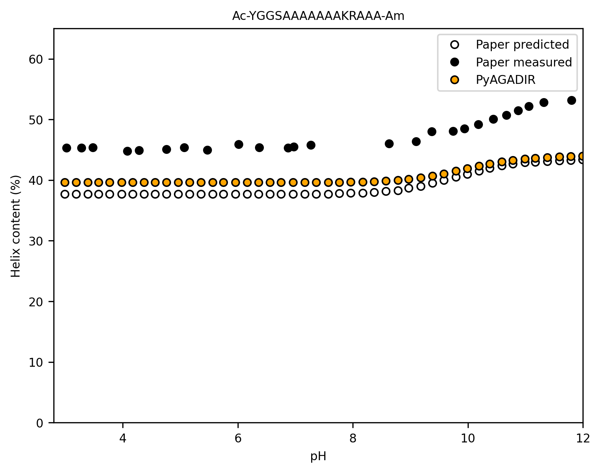
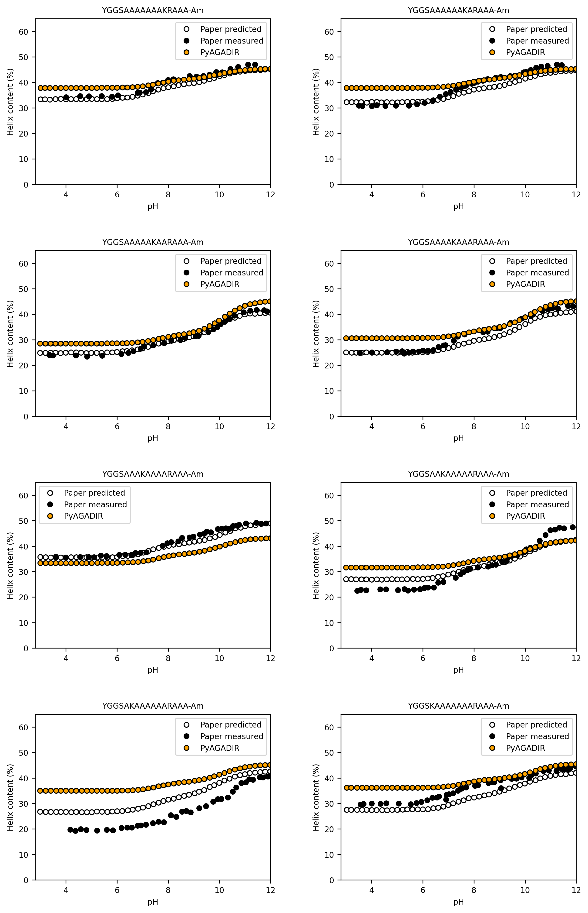
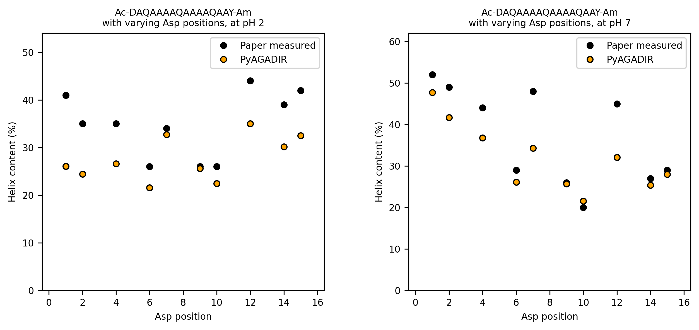

# α-helix probability model (pyAGADIR)

## Model Description

An open-source, Python implementation of Munoz & Serrano's AGADIR model of α-helix formation. This model uses statistical mechanics and energy parameters trained on a database of over 400 peptides to predict the α-helical tendency (probability) per residue for a given peptide (see references).

The energy parameters used in this model were extracted from the supplementary material of Lacroix, E., Viguera, A. R., & Serrano, L. (1998). Elucidating the folding problem of α-helices: local motifs, long-range electrostatics, ionic-strength dependence and prediction of NMR parameters. Journal of molecular biology, 284(1), 173-191. https://doi.org/10.1006/jmbi.1998.2145

The paper uses the terminology of Richardson & Richardson (1988) where STC (S, strand; T, turn; and C, coil) indicates a non-helical conformation and He is a helical residue. Python indexing starting from the Ncap is used to describe these positions in the model. The helical portion of the sequence are determined by providing a strating index i, and a helix length j. The first and last residues of the specified helical segments act as "capping" residues (Ncap and Ccap). 

In the following example, the helical segment is specified by i=2 and j=14.
```text
Sequence:  I    L    K     S    L    E    E    F    L    K    V    T    L    R    S    T    R    Q  
Name:      N''  N'   Ncap  N1   N2   N3   N4   N5.............C5   C4   C3   C2   C1   Ccap C'   C''  
Structure: STC  STC  STC---He---He---He---He---He---He---He---He---He---He---He---He---STC  STC  STC
Index:     0    1    2     3    4    5    6    7    8    9    10   11   12   13   14   15   16   17
```

The N- and C-terminal residues can optionally be modified with acylation, succinylation, or amidation. This is done to remove the influence of the terminal charges on the helical propensity. The model accounts for these modifications and treats them as indexable positions in the sequence. 

In the following example, the sequence is acetylated at the N-terminal and amidated at the C-terminal, with the helical segment specified by i=1 and j=6.
```text
Sequence:  Ac   K     S    L    E    E    F    L    K    V    T    L    R    S    T    R    Am 
Name:      N'   Ncap  N1   N2   C2   C1   Ccap C'   C''  
Structure: STC  STC---He---He---He---He---STC  STC  STC  STC  STC  STC  STC  STC  STC  STC  STC
Index:     0    1     2    3    4    5    6    7    8    9    10   11   12   13   14   15   16
```

For predicting the helical propensity of a sequence, the model uses the partition function, which is the sum of the probabilities of all possible helix conformations of the sequence; the model iterates over all possible i, j pairs and calculates the partition function for each. The helical propensity is then the probability of the helical conformation divided by the partition function.


## Installation

### Production Environment

Install the computational environment with Conda (https://conda.io):

```bash
# Create the environment
conda env create -f environment.yml

# Activate the environment
conda activate agadir

# Install the package in development mode
pip install -e .
```

### Development Environment

For development work (including running tests, formatting code, etc.), use the development environment:

```bash
# Create the development environment
conda env create -f environment-dev.yml

# Activate the development environment
conda activate agadir-dev

# Install the package in development mode
pip install -e .
```

The development environment includes additional tools:
- Jupyter notebooks for interactive development
- Matplotlib for visualization
- Code quality tools (black, flake8, isort, mypy)

To format and check your code in the development environment:
```bash
# Format code
black .
isort .

# Check code
flake8 .
mypy .
```

## Usage

The most simple way to use this package is to import and invoke the `AGADIR` model directly:
```python
# Initialize model with custom parameters
model = AGADIR(
    method='1s',   # Method for partition function: 'r' (residue) or '1s' (one-sequence)
    T=4.0,         # Temperature in Celsius
    M=0.15,        # Ionic strength in mol/L
    pH=7.0         # pH of solution
)

# Predict helical propensity
result = model.predict('ILKSLEEFLKVTLRSTRQT')
```

The result object provides several methods to access the predictions:
- `get_sequence()`: Returns the input peptide sequence
- `get_percent_helix()`: Returns the mean helical propensity (float)
- `get_helical_propensity()`: Returns the probability for each residue (numpy array)

### Terminal Capping

When predicting helix propensity, the charged termini can significantly affect the results. In real proteins, helices are typically part of a larger sequence and don't experience these terminal charges. The package supports three types of terminal modifications to simulate this:

- N-terminal modifications (ncap):
  - `'Ac'`: Acetylation - can act as a helix capping residue and neutralizes the positive N-terminal backbone charge.
  - `'Sc'`: Succinylation - can act as a helix capping residue, neutralizes the positive N-terminal backbone charge, BUT is treated as negatively charged.
- C-terminal modification (ccap):
  - `'Am'`: Amidation - can act as a helix capping residue and neutralizes the negative C-terminal backbone charge.

These modifications are particularly important when analyzing helices extracted from larger proteins. For example, if you're predicting the helical propensity of a segment taken from a crystal structure, you should consider adding these caps to better simulate the actual environment where the helix exists within the protein:

```python
# Analyzing a helix segment from a protein structure
segment = "ILKSLEEFLKVTLRSTRQT"
model = AGADIR(method='1s', T=4.0, pH=7.0)
result = model.predict(segment, 
                       ncap='Ac', 
                       ccap='Am'
                       )  # Add caps to simulate internal protein environment
```

### Energy Calculations

For detailed analysis, you can use the `EnergyCalculator` class directly to examine specific energy contributions. This class is used internally by the `AGADIR` model to calculate the partition function, but can also be used to calculate the energy contributions for a given sequence. It is important to note that the `EnergyCalculator` class only calculates the energy contributions for a single helix segment (a single i, j pair for a given sequence), and does not calculate the partition function.

```python
from pyagadir.energies import EnergyCalculator

# Initialize calculator
calc = EnergyCalculator(
    pept="ILKSLEEFLKVTLRSTRQT",
    pH=7.0,  # pH of solution
    T=4.0,  # Temperature in Celsius
    ionic_strength=0.15,  # Ionic strength in mol/L
    min_helix_length=6,  # Minimum helix length, default 6 as in the paper
    ncap='Ac',  # N-terminal acetylation 
    ccap='Am'  # C-terminal amidation
)

# Basic helix energies
intrinsic_energy = calc.get_dG_Int()  # Returns: np.ndarray
hbond_energy = calc.get_dG_Hbond()    # Returns: float

# Capping energies
ncap_energy = calc.get_dG_Ncap()      # Returns: np.ndarray
ccap_energy = calc.get_dG_Ccap()      # Returns: np.ndarray

# Special motif energies
staple_energy = calc.get_dG_staple()    # Returns: float
schellman_energy = calc.get_dG_schellman()  # Returns: float

# Side chain interactions
i3_interactions = calc.get_dG_i3()    # Returns: np.ndarray
i4_interactions = calc.get_dG_i4()    # Returns: np.ndarray

# Electrostatic and dipole interactions
electrostatic = calc.get_dG_electrost()  # Returns: np.ndarray
n_term_macro, c_term_macro = calc.get_dG_terminals_macrodipole()  # Returns: tuple[np.ndarray, np.ndarray]
dipole_n, dipole_c = calc.get_dG_sidechain_macrodipole()  # Returns: tuple[np.ndarray, np.ndarray]

Each energy term represents a different contribution to helix stability:
- Intrinsic energies: Base propensities for each residue
- H-bond energy: Main chain-main chain hydrogen bonds
- Capping energies: N- and C-terminal capping effects
- Staple motif: Hydrophobic interactions between N' and N4 residues
- Schellman motif: Special C-terminal capping interaction with glycine
- i,i+3 and i,i+4 interactions: Side chain interactions
- Electrostatic: Charged residue pair interactions
- Macrodipole: Interactions between charged residues and the helix dipole


## Validation

The implementation has been validated against the original AGADIR paper results. To run the validation:

1. Activate the development environment (required for matplotlib):
```bash
conda activate agadir-dev
```

2. Run the validation script:
```bash
python ./pyagadir/validation.py
```

This will generate comparison plots in the `pyagadir/data/figures` directory. 

Below is a validation plot for Figure 3b with reference data extracted from the original paper (Lacroix et al., 1998, using WebPlotDigitizer), showing the pH dependence of helix content:



Below is a validation plot for Figure 4 with reference data extracted from the original paper (Lacroix et al., 1998, using WebPlotDigitizer), showing the pH dependence of helix content:



Below is a validation plot for Figure 1A and 1B from Huygues-Despointes et al. (1995), showing peptides with Asp at different positions, at two pH values:



Below is a validation plot for Figure 4A-C from Munoz & Serrano (1997), showing repeats of the peptides AAQAA, AAKAA and AEAAKA:


## Questions / To Do
* Based on the validation plots, the model generally shows the correct trend, but some of the pH-dependent electrostatic energies look like they need work.
* How to make ionization state consistent between the different energy terms?
* Test correct functioning of staple term or schellman term.
* We need to locate a source for the N- and C-terminal pKa values for the individual amino acids. Currently using average value from Stryer.
* Update pytests to test all the code.
* Ionic strengths should probably be adjusted based on whether the ions are monovalent or divalent. Otherwise the screening correction may not be correct.
* The original papers used to have an i-i+1 term, but it's not clear to me how this is accounted for in Lacroix et al. (1998), and consequently in this implementation.
* The values in table 5 are not currently used in the implementation. Figure out where they are needed.

## Citations

Muñoz, V., & Serrano, L. (1994). Elucidating the folding problem of helical peptides using empirical parameters. Nature structural biology, 1(6), 399-409. https://doi.org/10.1038/nsb0694-399

Munoz, V., & Serrano, L. (1995). Elucidating the folding problem of helical peptides using empirical parameters. II†. Helix macrodipole effects and rational modification of the helical content of natural peptides. Journal of molecular biology, 245(3), 275-296. https://doi.org/10.1006/jmbi.1994.0023

Muñoz, V., & Serrano, L. (1995). Elucidating the Folding Problem of Helical Peptides using Empirical Parameters. III> Temperature and pH Dependence. Journal of molecular biology, 245(3), 297-308. https://doi.org/10.1006/jmbi.1994.0024

Lacroix, E., Viguera, A. R., & Serrano, L. (1998). Elucidating the folding problem of α-helices: local motifs, long-range electrostatics, ionic-strength dependence and prediction of NMR parameters. Journal of molecular biology, 284(1), 173-191. https://doi.org/10.1006/jmbi.1998.2145

Munoz, V., & Serrano, L. (1997). Development of the multiple sequence approximation within the AGADIR model of α‐helix formation: Comparison with Zimm‐Bragg and Lifson‐Roig formalisms. Biopolymers: Original Research on Biomolecules, 41(5), 495-509. [https://doi.org/10.1002/(SICI)1097-0282(19970415)41:5<495::AID-BIP2>3.0.CO;2-H](https://doi.org/10.1002/(SICI)1097-0282(19970415)41:5<495::AID-BIP2>3.0.CO;2-H)

